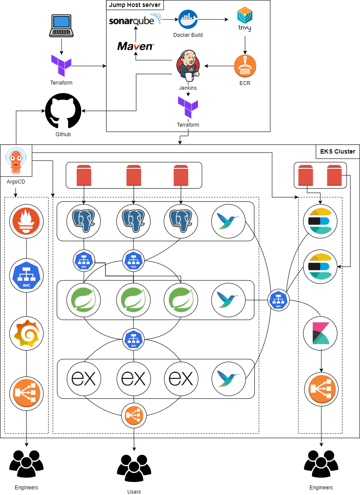

# Block Slicer
Block Slicer is an exhilarating full-stack game app designed for Kubernetes deployment, featuring advanced PostgreSQL replication and robust monitoring capabilities through the EFK stack (Elasticsearch, Fluentbit and Kibana). Engage in fast-paced slicing action, where precision and timing are key to conquering challenging levels and leaderboards.

## Architecture

## Documentation
It is highly recommended to follow this [Documentation](./docs/Deploying%20a%20Three-Tier%20Application%20on%20Amazon%20EKS%20Along%20with%20Prometheus,%20Grafana,%20and%20EFK%20Logging.pdf) for deployment.